# 🚀 Project Instructions System

> **A comprehensive, self-contained framework for guiding AI agents through complex project development tasks**

[](https://github.com/PadsterH2012/Instructors)
[](docs/)
[](docs/project-structure.md)

---

## 📋 Table of Contents

- [🎯 System Overview](#-system-overview)
- [⚡ Quick Start](#-quick-start)
- [✨ Key Features](#-key-features)
- [📚 Documentation](#-documentation)
- [🔄 System Workflow](#-system-workflow)
- [📁 Project Structure](#-project-structure)
- [🛡️ Safety & Maintenance](#️-safety--maintenance)
- [🔧 Updates & Support](#-updates--support)

---

## 🎯 System Overview

The **Isolated Project Instruction System** is a production-ready framework that guides AI agents through complex project development with complete safety and reliability. The system ensures instruction files remain untouched during execution while providing full functionality and resume capability.

### ✨ Key Benefits

| Feature | Description |
|---------|-------------|
| 🔒 **Complete Protection** | `project_instructions/` folder remains untouched during execution |
| 🗑️ **Safe Management** | `project_working_files/` can be safely deleted without affecting instructions |
| 🔄 **Resume Capability** | Continue work from any interruption point using intelligent status tracking |
| 📋 **Task Breakdown** | Complex tasks organized into logical, manageable components |
| 🔍 **Debug Transparency** | Comprehensive logging of agent reasoning and decision-making |
| 🚨 **Issue Tracking** | Active tracking of issues and workarounds with structured resolution |
| 🎭 **Simulate Mode** | Safe testing of instruction logic without executing actual changes |
| 📅 **Date Awareness** | Current date context for up-to-date research and technology choices |

---

## ⚡ Quick Start

### 🚀 Basic Execution

To initiate the system, provide this exact command to your AI agent:

```bash
Follow the instructions in project_instructions/project_instruction_index.md and resume from current status.
```

### 🔧 Advanced Options

<details>
<summary><strong>Debug Mode</strong> (detailed logging)</summary>

```bash
Follow the instructions in project_instructions/project_instruction_index.md and resume from current status.

--debug
```
</details>

<details>
<summary><strong>Simulate Mode</strong> (safe testing)</summary>

```bash
Follow the instructions in project_instructions/project_instruction_index.md and resume from current status.

--simulate-medium --simulate-testing
```
</details>

### 📋 Prerequisites

- **AI Agent Access** with file creation and web search capabilities
- **Required Tools**: `brave_web_search`, `Context7` tools, file creation tools
- **Project Plan**: Ensure `project_input/project_plan.txt` contains your requirements

---

## 📚 Documentation

Our documentation is organized for easy navigation and quick access:

### 🚀 Getting Started
- **[Getting Started Guide](docs/getting-started.md)** - Prerequisites, verification, and basic execution
- **[System Overview](docs/system-overview.md)** - Architecture, workflow, and core concepts

### 📖 Reference Documentation
- **[Module Reference](docs/module-reference.md)** - Detailed documentation of all 9 modules
- **[Project Structure](docs/project-structure.md)** - Folder organization and file management

### 🛠️ Advanced Features
- **[Issue Tracking](docs/issue-tracking.md)** - Active issue and workaround management system
- **[Simulate Mode](docs/simulate-mode.md)** - Multi-level simulation with accuracy tracking
- **[Debug Options](docs/debug-options.md)** - Debug mode and comprehensive logging

### 🔧 Support & Troubleshooting
- **[Troubleshooting Guide](docs/troubleshooting.md)** - Common issues, solutions, and recovery procedures

---

## 🔄 System Workflow

The system follows a structured 9-module workflow from initial setup to production-ready implementation:

```mermaid
flowchart LR
    M0[🏗️ Module 0<br/>Setup] --> M1[🔍 Module 1<br/>Research]
    M1 --> M2[📝 Module 2<br/>Docs]
    M2 --> M3[🏗️ Module 3<br/>LLD]
    M3 --> M4[📋 Module 4<br/>Tasks]
    M4 --> M5[✅ Module 5<br/>Validation]
    M5 --> M6[📊 Module 6<br/>Planning]
    M6 --> M7[📈 Module 7<br/>Tracking]
    M7 --> M8[🚀 Module 8<br/>Implementation]

    style M0 fill:#f3e5f5
    style M1 fill:#e8eaf6
    style M2 fill:#e0f2f1
    style M3 fill:#fff8e1
    style M4 fill:#fce4ec
    style M5 fill:#e1f5fe
    style M6 fill:#f1f8e9
    style M7 fill:#fff3e0
    style M8 fill:#e8f5e8
```



### 📊 Module Overview

| Module | Name | Purpose | Key Outputs |
|--------|------|---------|-------------|
| **0** | 🏗️ **Initial Setup** | Creates isolated structure & captures system context | `project_working_files/`, `system_info.env`, `project_context.md` |
| **1** | 🔍 **Research Phase** | Technology research with current date context | Research files in `working_files/research/` |
| **2** | 📝 **Documentation** | Project scope and high-level design | Core documentation in `docs/` |
| **3** | 🏗️ **LLD Creation** | Low-Level Design files (500-750 lines each) | LLD files in `working_files/design/` |
| **4** | 📋 **Task Management** | Task breakdown and gap analysis | Task management in `working_files/tasks/` |
| **5** | ✅ **Validation** | Final validation of all deliverables | Validation reports in `docs/` |
| **6** | 📊 **Planning** | High-level project roadmap with MVP progression | Master plan in `docs/high_level_plan.md` |
| **7** | 📈 **Tracking** | Implementation tracking with task-level progress | Implementation plan in `implementation_plan/` |
| **8** | 🚀 **Implementation** | Complete project build with Docker & testing | Full project implementation |

**📊 Visual Workflow**: See **[WORKFLOW_DIAGRAM.md](WORKFLOW_DIAGRAM.md)** for comprehensive Mermaid diagrams.

---

## 📁 Project Structure

```
project_instructions/          # 🔒 Protected instruction system (never modified)
├── instruction_modules/       # 9 core execution modules
├── docs/                     # Comprehensive documentation
├── templates/                # File templates for consistency
├── scripts/                  # Update and utility scripts
└── project_input/           # Your project requirements

project_working_files/        # 🗑️ Safe working area (can be deleted)
├── working_files/           # Module outputs and research
├── docs/                    # Generated documentation
├── implementation_plan/     # Task-level tracking (Module 7+)
└── status.md               # Progress tracking

simulate/                    # 🎭 Simulation logs (git ignored)
archivebin/                 # 📦 Backup and archived files
```

**📖 Complete Details**: See **[Project Structure Guide](docs/project-structure.md)** for detailed folder organization.

## ✨ Key Features

### 📅 Date Context Awareness
- Captures current system date for up-to-date research
- Prevents outdated technology searches
- Ensures current year information in all research

### 🔄 Resume Capability
- Automatic resume from any interruption point
- Status tracking at module and task levels
- Validation of completed work before proceeding

### 🚨 Issue Tracking
- Active tracking of issues and workarounds
- Priority-based resolution management
- Integration with development phases

### 🎭 Simulate Mode
- Multi-level simulation (1-9 complexity levels)
- Targeted testing with feature switches
- Accuracy tracking and validation

For detailed information on these features, see the corresponding documentation in the [docs/](docs/) directory.

## 🛡️ Safety and Maintenance

### Instruction Protection
- `project_instructions/` folder is **never modified** during execution
- All agent work happens in separate `project_working_files/` folder
- Instructions remain pristine and reusable

### Safe Working File Management
- Delete entire `project_working_files/` folder for a clean restart
- Keep `project_instructions/` folder intact
- Status tracking will detect missing files and restart appropriate modules

For troubleshooting common issues and system integrity verification, see the **[Troubleshooting Guide](docs/troubleshooting.md)**.

## 🔧 Updates & Support

### Automated Update Script

The system includes an automated update script that can download the latest version from GitHub without requiring git:

```bash
curl -sSL https://raw.githubusercontent.com/PadsterH2012/Instructors/main/project_instructions/scripts/update.sh | bash
```

For detailed update procedures, best practices, and rollback instructions, see the **[Troubleshooting Guide](docs/troubleshooting.md)**.

---

## 🎉 Quick Start Summary

1. **Update** to latest version (optional): `curl -sSL https://raw.githubusercontent.com/PadsterH2012/Instructors/main/project_instructions/scripts/update.sh | bash`
2. **Verify** `project_instructions/` folder structure is intact
3. **Ensure** `project_input/project_plan.txt` contains your project requirements
4. **Execute** with: `Follow the instructions in project_instructions/project_instruction_index.md and resume from current status.`
5. **Add** `--debug` flag for troubleshooting
6. **Monitor** progress in `project_working_files/status.md`
7. **Review** outputs in `project_working_files/` folder structure

The system is designed to be **safe**, **resumable**, **date-aware**, **quality-focused**, and **completely isolated** for maximum reliability and comprehensive deliverables.
