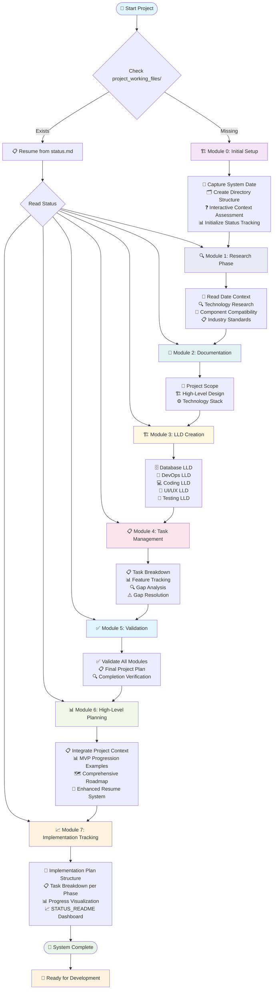
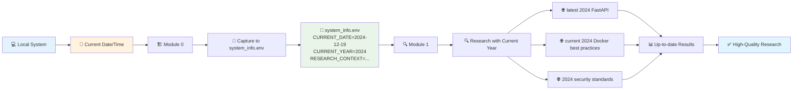
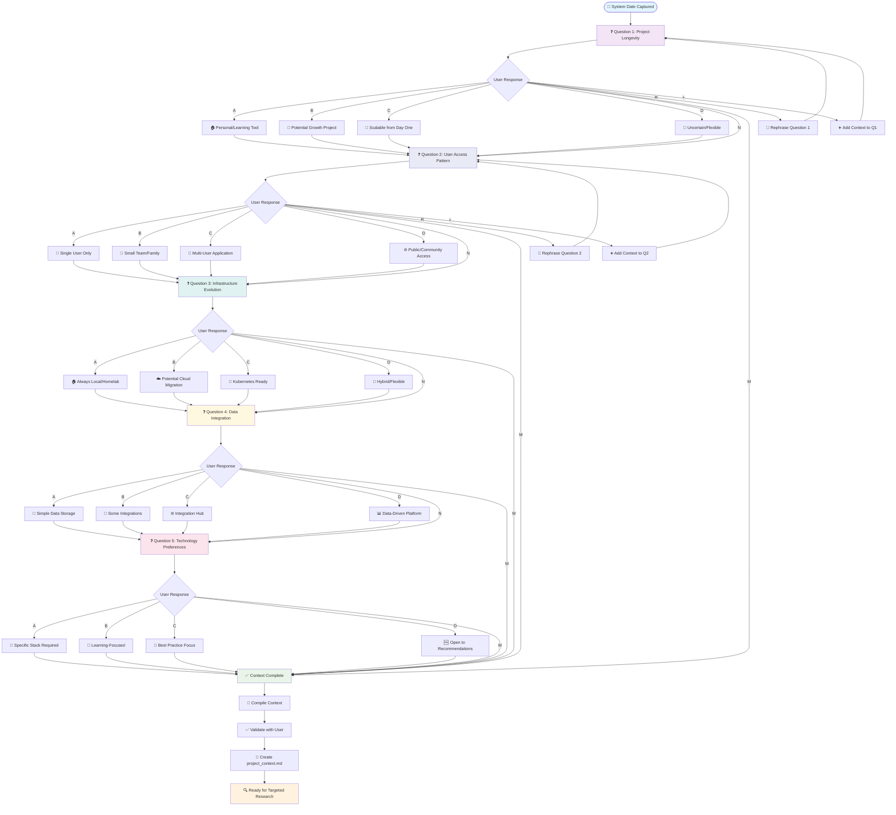
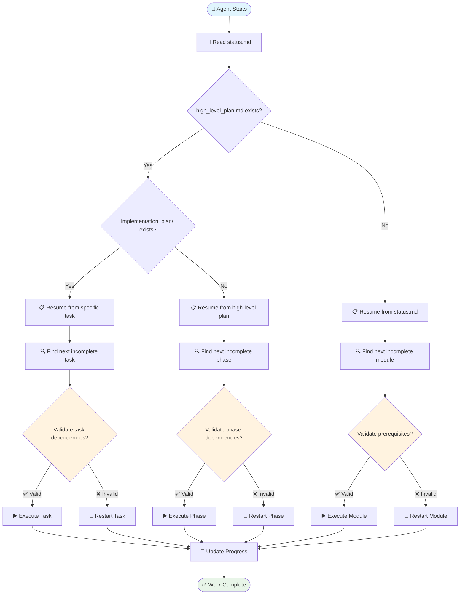
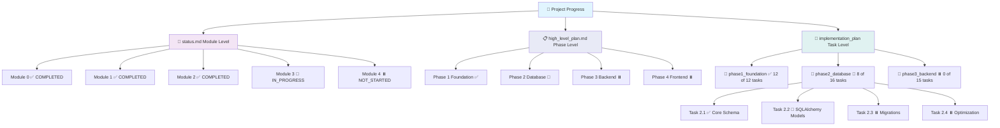
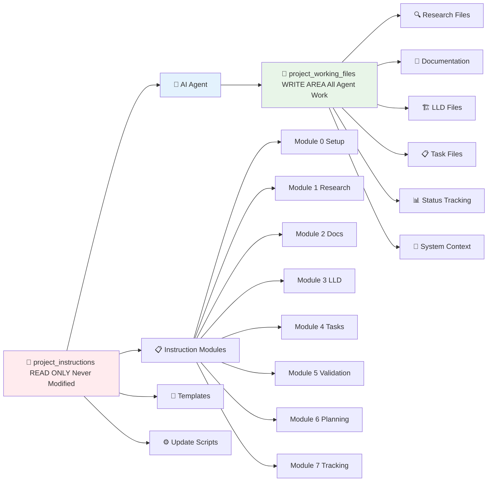
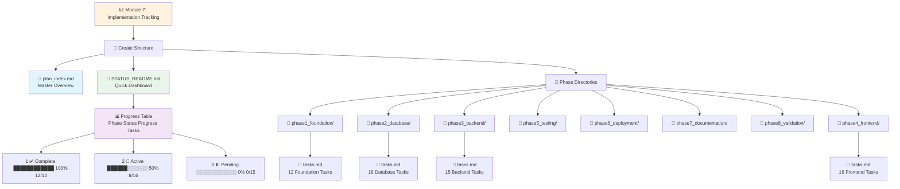

# Project Instruction System - Workflow Diagram

This document provides visual representations of the project instruction system workflow using Mermaid diagrams.

## 🔄 Complete System Workflow

## 📅 Date Context Flow

## ❓ Progressive Context Assessment (Module 0)

## 🔄 Resume System Logic

## 📊 Progress Tracking Hierarchy

## 🛡️ Safety and Isolation

## 📈 Implementation Tracking (Module 7 Output)

---

*These diagrams provide a comprehensive visual overview of the project instruction system workflow, from initial setup through implementation tracking.*
