# Project Instruction System - Workflow Diagram

This document provides visual representations of the project instruction system workflow using Mermaid diagrams.

## 🔄 Complete System Workflow

```mermaid
flowchart TD
    Start([🚀 Start Project]) --> Check{Check project_working_files/}

    Check -->|Exists| Resume[📋 Resume from status.md]
    Check -->|Missing| M0[🏗️ Module 0: Initial Setup]

    Resume --> Status{Read Status}
    Status --> M1[🔍 Module 1: Research Phase]
    Status --> M2[📝 Module 2: Documentation]
    Status --> M3[🏗️ Module 3: LLD Creation]
    Status --> M4[📋 Module 4: Task Management]
    Status --> M5[✅ Module 5: Validation]
    Status --> M6[📊 Module 6: High-Level Planning]
    Status --> M7[📈 Module 7: Implementation Tracking]

    M0 --> M0_Tasks[📅 Capture System Date<br/>🗂️ Create Directory Structure<br/>📊 Initialize Status Tracking]
    M0_Tasks --> M1

    M1 --> M1_Tasks[📅 Read Date Context<br/>🔍 Technology Research<br/>🔧 Component Compatibility<br/>📋 Industry Standards]
    M1_Tasks --> M2

    M2 --> M2_Tasks[📖 Project Scope<br/>🏗️ High-Level Design<br/>⚙️ Technology Stack]
    M2_Tasks --> M3

    M3 --> M3_Tasks[🗄️ Database LLD<br/>🚀 DevOps LLD<br/>💻 Coding LLD<br/>🎨 UI/UX LLD<br/>🧪 Testing LLD]
    M3_Tasks --> M4

    M4 --> M4_Tasks[📋 Task Breakdown<br/>📊 Feature Tracking<br/>🔍 Gap Analysis<br/>⚠️ Gap Resolution]
    M4_Tasks --> M5

    M5 --> M5_Tasks[✅ Validate All Modules<br/>📋 Final Project Plan<br/>🔍 Completion Verification]
    M5_Tasks --> M6

    M6 --> M6_Tasks[👤 User Context Assessment<br/>📊 MVP Progression Examples<br/>🗺️ Comprehensive Roadmap<br/>🔄 Enhanced Resume System]
    M6_Tasks --> M7

    M7 --> M7_Tasks[📁 Implementation Plan Structure<br/>📋 Task Breakdown per Phase<br/>📊 Progress Visualization<br/>📈 STATUS_README Dashboard]
    M7_Tasks --> Complete([🎉 System Complete])

    Complete --> Dev[🚀 Ready for Development]

    style Start fill:#e1f5fe
    style Complete fill:#e8f5e8
    style Dev fill:#fff3e0
    style M0 fill:#f3e5f5
    style M1 fill:#e8eaf6
    style M2 fill:#e0f2f1
    style M3 fill:#fff8e1
    style M4 fill:#fce4ec
    style M5 fill:#e1f5fe
    style M6 fill:#f1f8e9
    style M7 fill:#fff3e0
```

## 📅 Date Context Flow

```mermaid
flowchart LR
    System[💻 Local System] --> Date[📅 Current Date/Time]
    Date --> M0[🏗️ Module 0]
    M0 --> Capture[📝 Capture to system_info.env]

    Capture --> Env[📄 system_info.env<br/>CURRENT_DATE=2024-12-19<br/>CURRENT_YEAR=2024<br/>RESEARCH_CONTEXT=...]

    Env --> M1[🔍 Module 1]
    M1 --> Research[🔍 Research with Current Year]
    Research --> Query1[🌐 latest 2024 FastAPI]
    Research --> Query2[🌐 current 2024 Docker best practices]
    Research --> Query3[🌐 2024 security standards]

    Query1 --> Results[📊 Up-to-date Results]
    Query2 --> Results
    Query3 --> Results

    Results --> Quality[✅ High-Quality Research]

    style System fill:#e3f2fd
    style Date fill:#fff3e0
    style Env fill:#e8f5e8
    style Quality fill:#e1f5fe
```

## 🔄 Resume System Logic

```mermaid
flowchart TD
    Start([🚀 Agent Starts]) --> ReadStatus[📖 Read status.md]

    ReadStatus --> CheckPlan{high_level_plan.md exists?}

    CheckPlan -->|Yes| CheckImpl{implementation_plan/ exists?}
    CheckPlan -->|No| StatusResume[📋 Resume from status.md]

    CheckImpl -->|Yes| TaskResume[📋 Resume from specific task]
    CheckImpl -->|No| PlanResume[📋 Resume from high-level plan]

    StatusResume --> FindModule[🔍 Find next incomplete module]
    PlanResume --> FindPhase[🔍 Find next incomplete phase]
    TaskResume --> FindTask[🔍 Find next incomplete task]

    FindModule --> ValidateModule{Validate prerequisites?}
    FindPhase --> ValidatePhase{Validate phase dependencies?}
    FindTask --> ValidateTask{Validate task dependencies?}

    ValidateModule -->|✅ Valid| ExecuteModule[▶️ Execute Module]
    ValidateModule -->|❌ Invalid| RestartModule[🔄 Restart Module]

    ValidatePhase -->|✅ Valid| ExecutePhase[▶️ Execute Phase]
    ValidatePhase -->|❌ Invalid| RestartPhase[🔄 Restart Phase]

    ValidateTask -->|✅ Valid| ExecuteTask[▶️ Execute Task]
    ValidateTask -->|❌ Invalid| RestartTask[🔄 Restart Task]

    ExecuteModule --> UpdateStatus[📝 Update Progress]
    ExecutePhase --> UpdateStatus
    ExecuteTask --> UpdateStatus

    RestartModule --> UpdateStatus
    RestartPhase --> UpdateStatus
    RestartTask --> UpdateStatus

    UpdateStatus --> Complete([✅ Work Complete])

    style Start fill:#e1f5fe
    style Complete fill:#e8f5e8
    style ValidateModule fill:#fff3e0
    style ValidatePhase fill:#fff3e0
    style ValidateTask fill:#fff3e0
```

## 📊 Progress Tracking Hierarchy

```mermaid
flowchart TD
    Project[🎯 Project Progress] --> Status[📄 status.md Module Level]
    Project --> Plan[📋 high_level_plan.md Phase Level]
    Project --> Impl[📁 implementation_plan Task Level]

    Status --> M0[Module 0 ✅ COMPLETED]
    Status --> M1[Module 1 ✅ COMPLETED]
    Status --> M2[Module 2 ✅ COMPLETED]
    Status --> M3[Module 3 🔄 IN_PROGRESS]
    Status --> M4[Module 4 ⏸️ NOT_STARTED]

    Plan --> P1[Phase 1 Foundation ✅]
    Plan --> P2[Phase 2 Database 🔄]
    Plan --> P3[Phase 3 Backend ⏸️]
    Plan --> P4[Phase 4 Frontend ⏸️]

    Impl --> Phase1[📁 phase1_foundation ✅ 12 of 12 tasks]
    Impl --> Phase2[📁 phase2_database 🔄 8 of 16 tasks]
    Impl --> Phase3[📁 phase3_backend ⏸️ 0 of 15 tasks]

    Phase2 --> T1[Task 2.1 ✅ Core Schema]
    Phase2 --> T2[Task 2.2 🔄 SQLAlchemy Models]
    Phase2 --> T3[Task 2.3 ⏸️ Migrations]
    Phase2 --> T4[Task 2.4 ⏸️ Optimization]

    style Project fill:#e1f5fe
    style Status fill:#f3e5f5
    style Plan fill:#e8eaf6
    style Impl fill:#e0f2f1
```

## 🛡️ Safety and Isolation

```mermaid
flowchart LR
    Instructions[📁 project_instructions READ ONLY Never Modified] --> Agent[🤖 AI Agent]

    Agent --> Working[📁 project_working_files WRITE AREA All Agent Work]

    Instructions --> Modules[📋 Instruction Modules]
    Instructions --> Templates[📄 Templates]
    Instructions --> Scripts[⚙️ Update Scripts]

    Working --> Research[🔍 Research Files]
    Working --> Docs[📖 Documentation]
    Working --> Design[🏗️ LLD Files]
    Working --> Tasks[📋 Task Files]
    Working --> Status[📊 Status Tracking]
    Working --> System[📅 System Context]

    Modules --> M0[Module 0 Setup]
    Modules --> M1[Module 1 Research]
    Modules --> M2[Module 2 Docs]
    Modules --> M3[Module 3 LLD]
    Modules --> M4[Module 4 Tasks]
    Modules --> M5[Module 5 Validation]
    Modules --> M6[Module 6 Planning]
    Modules --> M7[Module 7 Tracking]

    style Instructions fill:#ffebee
    style Working fill:#e8f5e8
    style Agent fill:#e3f2fd
```

## 📈 Implementation Tracking (Module 7 Output)

```mermaid
flowchart TD
    M7[📊 Module 7: Implementation Tracking] --> Structure[📁 Create Structure]

    Structure --> PlanIndex[📄 plan_index.md<br/>Master Overview]
    Structure --> StatusDash[📄 STATUS_README.md<br/>Quick Dashboard]
    Structure --> PhaseDirs[📁 Phase Directories]

    PhaseDirs --> P1[📁 phase1_foundation/]
    PhaseDirs --> P2[📁 phase2_database/]
    PhaseDirs --> P3[📁 phase3_backend/]
    PhaseDirs --> P4[📁 phase4_frontend/]
    PhaseDirs --> P5[📁 phase5_testing/]
    PhaseDirs --> P6[📁 phase6_deployment/]
    PhaseDirs --> P7[📁 phase7_documentation/]
    PhaseDirs --> P8[📁 phase8_validation/]

    P1 --> T1[📄 tasks.md<br/>12 Foundation Tasks]
    P2 --> T2[📄 tasks.md<br/>16 Database Tasks]
    P3 --> T3[📄 tasks.md<br/>15 Backend Tasks]
    P4 --> T4[📄 tasks.md<br/>16 Frontend Tasks]

    StatusDash --> Table[📊 Progress Table<br/>Phase Status Progress Tasks ETA]

    Table --> Row1[1 ✅ Complete ████████████ 100% 12/12 Done]
    Table --> Row2[2 🔄 Active ██████░░░░░░ 50% 8/16 3 days]
    Table --> Row3[3 ⏸️ Pending ░░░░░░░░░░░░ 0% 0/15 TBD]

    style M7 fill:#fff3e0
    style PlanIndex fill:#e1f5fe
    style StatusDash fill:#e8f5e8
    style Table fill:#f3e5f5
```

---

*These diagrams provide a comprehensive visual overview of the project instruction system workflow, from initial setup through implementation tracking.*
